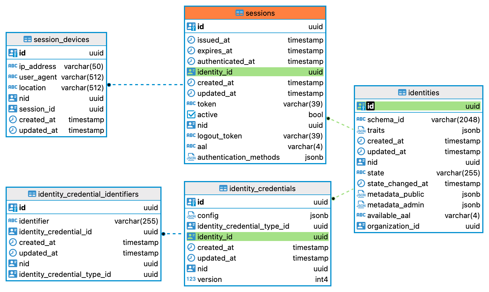

# ORY 全家桶

随着互联网应用的日益复杂，身份管理和访问控制成为开发者必须攻克的关键挑战。为了打造高效且安全的现代化应用，我们亟需一套强大的解决方案。本文将深入探讨 ORY 全家桶，在身份即服务（IDaaS）领域，它为我们提供了涵盖登录认证、用户 ID 管理、权限和访问控制、API 访问和 OAuth2 等全方位的解决方案。

## ORY 全家桶简介

ORY 全家桶是一个开源的身份管理解决方案集合，旨在为开发者提供一套全面的工具，以解决身份认证与授权问题。其核心组件包括：

1. ORY Kratos：一个用户管理系统，专注于自定义用户登录、注册和身份管理。
2. ORY Hydra：一个 OAuth2 和 OpenID Connect 服务器，帮助应用实现安全的用户登录和 API 访问。
3. ORY Keto：一个访问控制引擎，基于开源的 Google Zanzibar 模型，提供灵活的权限管理。
4. ORY Oathkeeper：一个身份和访问代理，用于保护 API 和应用的入口。

<p align="center">
  
</p>

### ORY Kratos

Kratos 的领域模型专注于用户身份管理，涵盖了用户身份、会话、身份验证器和恢复策略等多个方面。

- 用户身份 ：用户的基本信息和认证数据。
- 会话 ：用户的登录状态。
- 身份验证器 ：支持多种认证方式，如密码、MFA 等。
- 恢复策略 ：账户恢复和密码重置流程。

核心逻辑

- 身份管理 ：支持用户注册、登录、注销和信息更新。
- 自定义认证流程 ：允许开发者定义复杂的身份验证和注册逻辑。

亮点设计

- 模块化架构 ：各个功能模块可独立配置和扩展。
- 多协议支持 ：支持多种身份验证协议，适应不同的安全需求。

### ORY Hydra

ORY Hydra 专注于实现 OAuth2 和 OpenID Connect 协议，其领域模型涵盖了客户端、授权请求、访问令牌、刷新令牌等多个关键实体。

- 客户端 ：代表可以请求访问令牌的应用程序。
- 授权请求 ：用户同意或拒绝访问请求的流程。
- 令牌 ：用于访问受保护资源的凭证。

核心逻辑

- OAuth2 授权流程 ：支持授权码、隐式、客户端凭证和资源所有者密码凭证四种授权模式。
- OpenID Connect：扩展 OAuth2，提供用户身份验证功能。

亮点设计

- 可扩展性 ：Hydra 允许开发者通过插件机制扩展其功能。
- 高可用性 ：设计为无状态服务，便于水平扩展。
- 安全性 ：实现了 OAuth2 和 OIDC 的所有安全最佳实践。

### ORY Keto

Keto 基于 Google Zanzibar 模型进行权限管理，其核心模型包括关系、角色、权限和资源等多个方面。

- 关系 ：定义用户、角色、资源之间的关联。
- 角色 ：用户可以被赋予不同的角色，每个角色具有特定的权限。
- 资源 ：被保护的对象或数据。

核心逻辑

- 关系查询 ：高效地评估用户是否有权访问某个资源。
- 权限继承 ：支持复杂的权限继承和角色间的层级关系。

亮点设计

- 灵活的权限模型 ：支持动态的权限规则，适应复杂的业务逻辑。
- 高性能 ：优化的查询引擎，能够处理大规模的权限数据。

### ORY Oathkeeper

Oathkeeper 作为身份和访问代理，其模型涵盖了规则、身份提供者、认证器和授权者等多个关键组件。

- 规则 ：定义请求的处理逻辑，包括身份验证和授权。
- 身份提供者 ：外部系统，提供身份验证服务。
- 认证器 ：用于验证请求者身份的组件。
- 授权者 ：用于决定请求是否被允许的组件。

核心逻辑

- 请求代理 ：拦截和处理所有进入的请求，根据规则进行身份验证和授权。
- 策略执行 ：支持多种策略执行模式，灵活配置请求处理逻辑。

亮点设计

- 可插拔架构 ：认证和授权模块都可以通过插件进行扩展。
- 集中管理 ：集中化管理 API 的安全策略，简化安全配置。

## ORY 全家桶部署

部署 ORY 全家桶并不复杂，以下是一个简洁的指南，帮助您快速在本地环境中启动它：

### 环境准备

- Docker：确保你的系统上已经安装了 Docker。
- Docker Compose：用于管理多个 Docker 容器的工具。

### 部署步骤

我们直接提供了一个 ORY 全家桶部署的 docker-compose.yml 和所有模块的配置，放在本项目的 idaas/ory 目录中：

```shell
git clone https://github.com/zhijingtech/apaas-docs.git
cd apaas-docs/idaas/ory
docker-compose up
```

这将启动 Hydra、Kratos 和 Keto 服务。通过 docker desktop 检查各个服务是否正常运行，名称中带 migrate 的容器处于退出状态是正常。

**注意**：启动过程中一定会遇到 migrate 容器报错，原因是各个组件的 migrate 工具会重复创建 network 表，导致冲突，此时可以把报错的迁移 version 插入 schema_migration 即可。比如遇到如下报错时：

```shell
2024-11-26 18:52:44 ERROR: relation "networks" already exists (SQLSTATE 42P07)
2024-11-26 18:52:44 error executing migrations/20150101000001000000_networks.postgres.up.sql, sql: -- Migration generated by the command below; DO NOT EDIT.
```

记得插入一条 schema_migration 记录，vesion 的值取值日志：

```sql
-- hydra-migrate 报错
INSERT INTO schema_migration ("version", version_self) VALUES('20150101000001000000', 0);
-- Keto-migrate 报错
INSERT INTO schema_migration ("version", version_self) VALUES('20150100000001000000', 0);
```

如果没有容器在不停的重启，基本上代表部署成功了。

## ORY 全家桶测试

所有测试请求均通过 Oathkeeper Proxy 转发至其他模块，具体转发规则请参见 Oathkeeper 的配置文件 [access-rules.yml](oathkeeper/config/access-rules.yml)，后续将不再赘述。如果将 ORY 应用于生产，通过 Oathkeeper 或者其他网关构建零信任系统，禁止业务接口直接暴露外网，是一种比较安全的设计。

### Kratos 功能测试

Kratos 允许用户自己配置注册、登录、用户设置、账号恢复等流程，流程又分成了 browser（适用于浏览器端，有重定向和 Cookies 逻辑）和 api（适用于移动端）两种，使用的安全措施会有所不同但是返回的模型一致。详见：https://www.ory.sh/docs/kratos/self-service。

#### Kratos 用户注册

这里为了测试方便，我们直接打开 ORY 官方提供的 kratos-selfservice-ui-node 来测试。首选打开 http://127.0.0.1:4455/welcome，并点击左侧的 Sign Up，打开用户注册的页面，输入邮箱密码并提交，然后验证邮箱。由于我们用的是本地测试，没有真的发邮件，可以打开 http://127.0.0.1:4436/ 查看消息发送记录，找到用于邮箱验证的 code。验证通过后，用户注册流程完成。

此时后台的数据库发生了如下变更：

- identities 生成一条用户 ID 记录。
- identity_credentials 生成一条用户登录的凭证记录，比如密码登录，密码加密存储。
- identity_credential_identifiers 生成一条用户凭证标识记录，比如登录的邮箱、手机号等，绑定上面的登录凭证，可以组合出多种登录方式。
- identity_recovery_addresses 生成一条邮箱恢复链接记录。
- identity_verifiable_addresses 生成一条邮箱验证链接记录，处于 pending 状态，发送验证码后变为 sent 状态，验证完成后变为 completed 状态。
- identity_verification_codes 生成一条邮箱验证码记录，code 加密存储。
- sessions 生产另一条会话记录，用于登录状态的保持，处于 active 状态。
- session_devices 生成一条登录设备记录，关联上面的会话。
- selfservice_verification_flows 生成一条邮箱验证流程，有效期是 1 个小时，处于 sent_email 状态。
- courier_messages、courier_message_dispatches 生成几条邮箱验证链接发送记录，本测试会发送失败并重试。

##### identities、identity_credentials、identity_credential_identifiers、sessions、session_devices 表的补充说明

<p align="center">
  
</p>

在 ORY Kratos 中，这些表共同构成了身份管理系统的核心部分。它们分别用于存储用户身份、凭证、会话等信息，并且相互关联以实现完整的身份和会话管理功能。以下是每个表的作用和它们之间的关系：

1. **identities**:

   - **作用**: 存储用户的身份信息。每个用户在系统中对应一条记录。
   - **内容**: 包含用户的基本信息，如 ID、traits（用户属性）等。
   - **关系**: 通过用户 ID 关联到 `identity_credentials` 表。

2. **identity_credentials**:

   - **作用**: 存储与身份关联的凭证信息。
   - **内容**: 包含不同类型的凭证信息，如密码、OAuth2 凭证等。
   - **关系**: 与 `identities` 表关联，标识某个身份的凭证。

3. **identity_credential_identifiers**:

   - **作用**: 存储凭证的标识，比如用户名、电子邮件等。
   - **内容**: 包含凭证标识和凭证类型的映射。
   - **关系**: 与 `identity_credentials` 表关联，用于快速查找和验证凭证。

4. **sessions**:

   - **作用**: 存储用户会话信息。
   - **内容**: 包含会话的状态、创建时间、过期时间等信息。
   - **关系**: 与 `identities` 表关联，以标识特定用户的会话。

5. **session_devices**:
   - **作用**: 存储与用户会话相关的设备信息。
   - **内容**: 包含设备类型、操作系统、浏览器信息等。
   - **关系**: 与 `sessions` 表关联，以记录用户会话使用的设备。

这些表通过用户 ID 和凭证 ID 等字段相互关联，形成一个完整的身份和会话管理体系。这种设计允许 ORY Kratos 灵活地管理用户身份信息、凭证验证以及会话跟踪，支持多种身份验证和授权场景。更多详细信息可以在 ORY Kratos 的官方文档中找到。

#### Kratos 用户登录

再次打开 http://127.0.0.1:4455/welcome，并点击左侧的 Sign In，打开用户登录页面，输入邮箱密码并提交，登录成功后返回 welcome，点击左侧的 Session Information 就可以看到登录信息了。

```
id
9c2304d6-198f-4561-afe0-003d42adab84

email
local@test.com

signup date
2025-01-09T04:59:01.210934Z

authentication level
single-factor used (aal1)

session expires at
Fri, 10 Jan 2025 06:59:46 GMT

session authenticated at
Thu, 09 Jan 2025 06:59:46 GMT

authentication method used
password (Thu, 09 Jan 2025 06:59:46 GMT)
```

此时后台的数据库发生了如下变更：

- selfservice_login_flows 生成一条登录流程，有效期是 1 个小时。
- sessions 生产另一条会话记录，用于登录状态的保持，处于激活状态。
- session_devices 生成一条登录设备记录，关联上面的会话。

#### Kratos 用户登出

在 http://127.0.0.1:4455/welcome 页面上点击左侧的 Log Out，可以看到用户登出成功。

此时后台的数据库发生了如下变更：

- sessions 登录时的会话变成非激活状态。
- selfservice_login_flows 生成了一条新的登录流程，有效期是 1 个小时。这是因为用户登出后回到了登录页面，又初始化了一条登录流程。

#### Kratos 用户设置

在 http://127.0.0.1:4455/welcome 页面上，处于登录状态下，点击左侧的 Account Settings，打开用户设置页面，可以看到邮箱、密码等可以修改。

以修改密码为例，设置好新密码后点击保存，会要求重新登录，此时输入**旧密码**并提交，就可以完成修改。后台的数据库发生了如下变更：

- selfservice_settings_flows 生成一条用户设置流程，有效期是 1 个小时，处于 show_form 状态，最终修改成功后变成 success 状态。
- continuity_containers 生成一条记录新密码的临时记录，最终在用户设置成功后，这条记录会被删除。
- selfservice_login_flows 生成一条新的登录流程，有效期是 1 个小时。这是因为用户修改密码后回到了登录页面，又初始化了一条登录流程。
- sessions 重新登录后，当前的登录会话过期时间会刷新，并记录了登录方法。
- identities 当前的用户 ID 会更新。
- identity_credentials、identity_credential_identifiers 原登录标识（邮箱）和凭证（密码）会被删除，重新生成新的登录标识和凭证。

##### continuity_containers 表的补充说明

在 ORY Kratos 中，continuity_containers 表用于支持会话的连续性管理。具体来说，它用于存储在用户身份验证和会话管理过程中需要保持状态的信息。以下是一些关键用途：

- 状态存储 : continuity_containers 表用于存储与用户会话相关的临时状态信息，这些信息在多步骤的身份验证流程中是必要的。例如，在处理多因素身份验证（MFA）或复杂的注册流程时，可能需要在不同步骤之间保持某些状态。
- 临时数据 : 在身份验证过程中，某些数据需要暂时保存以供后续步骤使用，比如验证码、挑战问题的答案等。这些数据通常具有短期有效性。
- 防止重放攻击 : 通过保存会话状态，可以确保请求的顺序和完整性，防止攻击者重放先前的请求进行恶意操作。
- 自定义登录/注册流程 : 如果应用程序实现了自定义的登录或注册流程，continuity_containers 表可以用于存储流程的中间状态，确保用户体验的流畅性。

需要注意的是，continuity_containers 表中的数据通常是短期的，并且会在会话完成或超时后清理，以确保系统的高效和安全。具体的实现和配置细节可以在 ORY Kratos 的官方文档中找到。

#### Kratos 账号恢复

在 http://127.0.0.1:4455/welcome 页面上，处于未登录状态下，点击左侧的 Account Recovery，打开用户账号恢复页面，填写邮箱获取验证码，验证通过后会跳转到用户设置的页面，此时已经处于登录状态，可以直接修改密码保存。这里修改密码的流程跟用户设置有所不同，不需要用旧密码验证，因为此时已经通过 code 验证。从这里也可以看出 ory 设计的巧妙之处，定义不同的流程，可以灵活应对不同的场景。

此时后台的数据库发生了如下变更：

- selfservice_recovery_flows 生成一条账号恢复流程，有效期是 1 个小时，此时状态为 choose_method，发送验证码后变为 sent_email，验证成功后变为 passed_challenge。
- identity_recovery_codes 生成一条账号恢复的验证码，使用后会设置 used_at。
- courier_messages、courier_message_dispatches 记录了验证码的发送记录，不再展开。
- sessions 通过 code 验证后，登录成功，生成一条会话记录，处于激活状态。
- session_devices 生成一条登录设备记录，关联上面的会话。
- selfservice_settings_flows 生成一条用户设置流程，有效期是 1 个小时，处于 show_form 状态，最终修改成功后变成 success 状态。
- identities 当前的用户 ID 会更新。
- identity_credentials、identity_credential_identifiers 原登录标识（邮箱）和凭证（密码）会被删除，重新生成新的登录标识和凭证。

#### Kratos 社交登录（OIDC）

我们以 GitHub 授权登录为例，先上 [GitHub Developer Settings -> OAuth Apps](https://github.com/settings/developers) 创建一个 OAuth App，并获取 Client ID 和 Client Secret。然后回到本项目修改 Kratos 的配置，开启 OIDC 并配置好 OIDC Provider。

```yaml
selfservice:
  ...
  methods:
    ...
    oidc:
      enabled: true
      config:
        providers:
          - id: github
            provider: github
            client_id: <GitHub OAuth App 的 Client ID>
            client_secret: <GitHub OAuth App 的 Client Secret>
            issuer_url: https://github.com/login/oauth/authorize
            mapper_url: "base64://bG9jYWwgY2xhaW1zID0gewogIGVtYWlsX3ZlcmlmaWVkOiBmYWxzZSwKfSArIHN0ZC5leHRWYXIoJ2NsYWltcycpOwp7CiAgaWRlbnRpdHk6IHsKICAgIHRyYWl0czogewogICAgICAvLyBBbGxvd2luZyB1bnZlcmlmaWVkIGVtYWlsIGFkZHJlc3NlcyBlbmFibGVzIGFjY291bnQKICAgICAgLy8gZW51bWVyYXRpb24gYXR0YWNrcywgZXNwZWNpYWxseSBpZiB0aGUgdmFsdWUgaXMgdXNlZCBmb3IKICAgICAgLy8gZS5nLiB2ZXJpZmljYXRpb24gb3IgYXMgYSBwYXNzd29yZCBsb2dpbiBpZGVudGlmaWVyLgogICAgICAvLwogICAgICAvLyBUaGVyZWZvcmUgd2Ugb25seSByZXR1cm4gdGhlIGVtYWlsIGlmIGl0IChhKSBleGlzdHMgYW5kIChiKSBpcyBtYXJrZWQgdmVyaWZpZWQKICAgICAgLy8gYnkgR2l0SHViLgogICAgICBbaWYgJ2VtYWlsJyBpbiBjbGFpbXMgJiYgY2xhaW1zLmVtYWlsX3ZlcmlmaWVkIHRoZW4gJ2VtYWlsJyBlbHNlIG51bGxdOiBjbGFpbXMuZW1haWwsCiAgICB9LAogIH0sCn0="
            scope:
              - user:email
```

重启 Kratos，打开 http://127.0.0.1:4455/welcome，点击左侧的 Sign In，可以看到多了一个 GitHub 的授权登录，点击后会跳转到 GitHub 授权页面，授权后回到 Kratos，可以看到已经登录成功。

此时后台的数据库发生了如下变更：

- selfservice_login_flows 生成一条登录流程，有效期是 1 个小时，状态为 choose_method，选择 GitHub 授权登陆后，`active_method` 从 `null` 变为 `oidc`。
- continuity_containers 生成一条记录临时保存 ory_kratos_oidc_auth_code_session。
- selfservice_registration_flows 由于 GitHub 授权的账号之前没有注册过，所以会生成一条注册流程，有效期是 1 个小时，状态为 choose_method。
- identities 生成一条新用户记录，提取了 GitHub 的邮箱。
- identity_verifiable_addresses 生成一条邮箱验证的记录，状态为 `pending`，发送验证链接后变为 `sent`。
- identity_recovery_addresses 生成一条邮箱恢复链接记录。
- identity_credentials、identity_credential_identifiers 生成两套用户登录凭证及其标识，一套是邮箱，另一套是 GitHub 的 OpenID。
- sessions 生成一条会话记录，处于激活状态。
- session_devices 生成一条登录设备记录，关联上面的会话。
- identity_verification_codes 生成一条邮箱验证的验证码，使用后会设置 used_at。
- courier_messages、courier_message_dispatches 记录了邮箱验证链接的发送记录，不再展开。

### Hydra 测试

Hydra 是一个开源的 OAuth2 和 OpenID Connect 提供者，它提供了身份验证和授权服务。

#### Hydra OAuth 2.0

首先创建一个客户端，用于测试 OAuth2 流程。进入本项目目录 idaas/ory，执行以下命令：

```shell
code_client=$(docker compose exec hydra \
    hydra create client \
    --endpoint http://127.0.0.1:4445 \
    --grant-type authorization_code,refresh_token \
    --response-type code,id_token \
    --format json \
    --scope openid --scope offline \
    --redirect-uri http://127.0.0.1:5555/callback)

code_client_id=$(echo $code_client | jq -r '.client_id')
code_client_secret=$(echo $code_client | jq -r '.client_secret')
```

然后，启动一个示例 web 应用，来演示 OAuth 2.0 的授权码流程。执行下列命令后，访问 http://127.0.0.1:5555/ 页面。

```shell
docker compose exec hydra \
    hydra perform authorization-code \
    --client-id $code_client_id \
    --client-secret $code_client_secret \
    --endpoint http://127.0.0.1:4444/ \
    --port 5555 \
    --scope openid --scope offline
```

在页面上点击 Authorize application，输入用户名和密码，点击 Log in，选中 openid 和 offline，点击 Allow access，就可以得到如下信息：

```
Access Token: ory_at_88kCYzerrbWaJle7RLSZ8NrhJALS8Q9F6X69le43l_c.9Sm71y3cySqu0_A5e_NT6EOQb6nwyTtu4LaXt-jU4DA
Refresh Token: ory_rt_nfaxwpt7rqkWNPiSRh2UhePrz4oDDVbrE3fHyJz6abU.UFgtxuB7mAwjCB5HFDdLpe8cOpYTK7tw4-Jjz5vnbHw
Expires in: Wed, 15 Jan 2025 11:39:16 UTC
ID Token: ...
```

此时后台的数据库发生了如下变更：
- hydra_oauth2_authentication_session 生成一条 OAuth2 认证会话记录，里面记录了 subject。


---

5. 定义角色和权限：在 Keto 中创建角色和权限，测试不同角色对资源的访问控制。
6. 验证权限：尝试访问被保护的资源，验证权限控制的有效性。
   API 保护
7. 配置 OAuth2 客户端：在 Hydra 中注册一个 OAuth2 客户端。
8. 获取访问令牌：使用 OAuth2 流程获取访问令牌，测试 API 访问控制。
